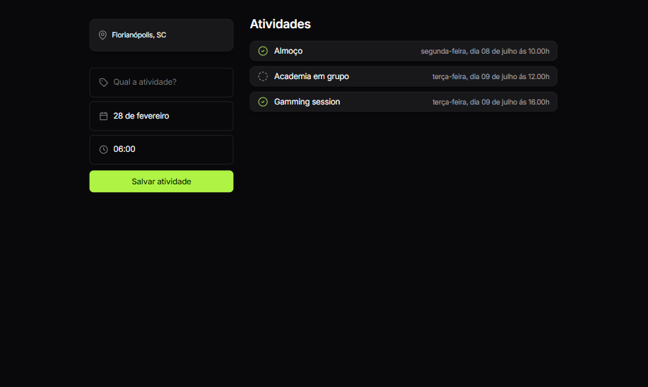

# Travel Planner

**Sobre o Projeto**  

O **Travel Planner** é uma aplicação web desenvolvida para ajudar os usuários a planejarem suas atividades de viagem de forma organizada e intuitiva. O projeto permite que o usuário adicione eventos com localização, data e horário, exibindo-os de forma clara em uma lista de atividades futuras.

---

**Funcionalidades**

- Adicionar uma atividade com:
  - Localização
  - Nome do evento
  - Data
  - Horário
- Visualização das atividades salvas
- Interface responsiva para dispositivos móveis

---

**Tecnologias Utilizadas**

- HTML
- CSS (incluindo estilos responsivos)
- JavaScript (para interatividade e manipulação do DOM)

---

**Responsividade**  
A interface do projeto foi projetada para ser totalmente responsiva, garantindo uma boa experiência tanto em desktops quanto em dispositivos móveis.

---

**Captura de Tela**

💻 **Versão Web**  


📱 **Versão Mobile**  


---

**Como Executar o Projeto**

1. Clone o repositório:

   ```bash
   git clone https://github.com/seu-usuario/travel-planner.git

2. Navegue até a pasta do projeto:

   ```
   cd travel-planner
   ```
4. Abra o arquivo `index.html` em seu navegador.


